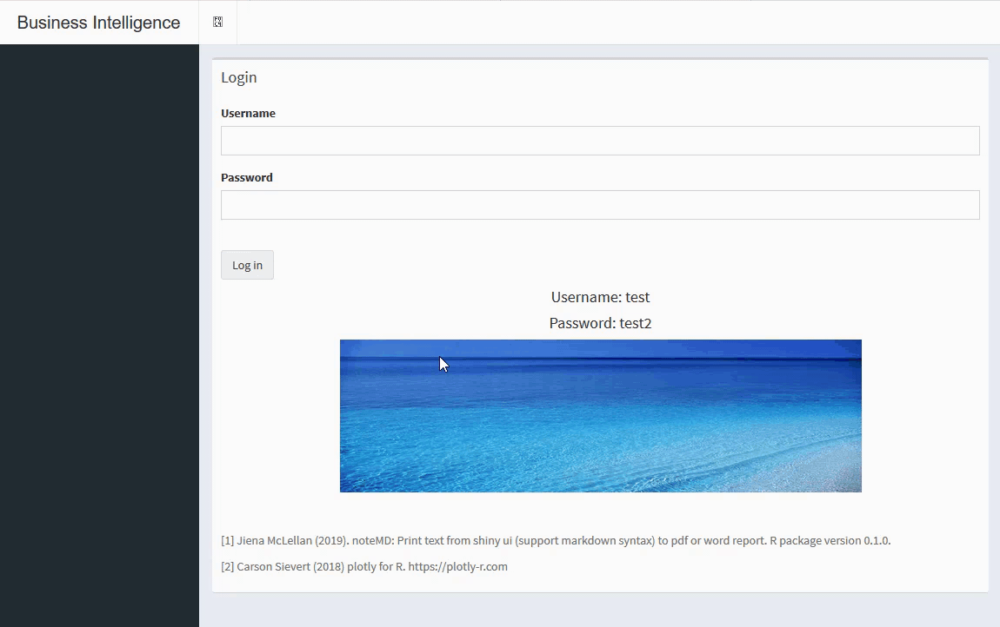

# A full workflow Shiny App
### **This app demonstrates the basic work flow from data entry to dynamic report. This display might be useful to create and host a small-scaled data platform and reporting system such as documenting team projects progress or monthly or weekly marketing performance platform.**

#### Data Entry: Users can add (modify, delete) data directly from the interface end. 
####  Data Visualization: Users can drill down specific category by clicking the pie in the pie chart. Clicking "Back" to turn back to previous view. 
####  Dynamic Reporting: Users can write down their comments and download reports in pdf, word or presentation. 

Live app: https://appforiarteam.shinyapps.io/Shiny_Plotly/ 

* Log in

